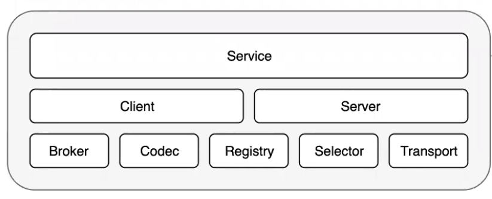
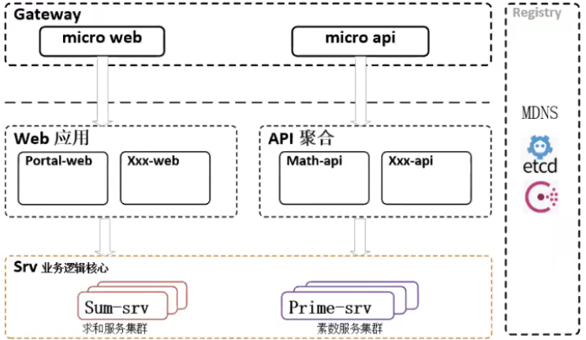

# 微服务

## 啥是微服务？

拆分成小服务，小服务之间靠进程间通信

## go-mirco设计与思想

- 插件化RPC框架
- 强定义的接口
- 聚焦微服务的核心需求
- 健全的默认实现：ETCD，HTTP， {json、proto}-rpc
- 扩展性：基于wrapper（包装器）与中间件实现

## 核心组件



- Client: 发送RPC请求和广播消息
- Server：接收RPC请求和消费消息

- Broker: 异步通信组件
- Codec: 数据编码组件
- Registry: 服务注册组件
- Selector: 客户端均衡器
- Transport: 同步通信组件

## 服务类型

对外提供服务的三种类型：RPC，OpenAPI, HTTP；
go-mirco的方案：

- SRV：内部RPC
- API：对外API
- Web：对外HTTP



1. 所有小于输入数字的自然数累加
2. 小于输入数字的所有素数

## 面临的问题

- 服务的注册和发现
- 服务之间的通信
- 服务的可靠性
- 部署

## 怎么解决以上问题?

- 注册与发现：ETCD,MSDN,Consul,ZK,Eureka..
- 服务间通信：HTTP,TCP,UDP,MQ(同步/异步)
- 服务可靠性：TTL/Interval，基于Wrapper的限流熔断等特性。

## go-micro编写服务的主要流程

1.定义接口
\>基于Proto协议（srv）

```proto
syntax = "proto3";

option go_package ="/sum";

message SumRequest {
    int64 input = 1;
}

message SumResponse {
    int64 output = 1;
}

service Sum {
    rpc GetSum (SumRequest) returns (SumResponse){
    }
} 
```

\>使用protoc-gen-micro插件生成Micro代码（srv）

要现安装protoc，protoc-gen-go，protoc-gen-micro

```shell
protoc --proto_path=. --go_out=. --micro_out=. sum/sum.proto
```

2.实现接口
\>定义Handler

/handler/handler.go

```go
package handler

import (
 "context"
 "learningMicroService/proto/sum"
 "learningMicroService/sum-srv/service"
)

type handler struct{}

func (h handler) GetSum(ctx context.Context, req *sum.SumRequest, rsp *sum.SumResponse) error {
 input := req.Input
 rsp.Output = service.GetSum(input)
 return nil
}

func GetHandler() sum.SumHandler {
 return handler{}
}

```

service/service.go 服务的具体实现

```go
package service

func GetSum(input int64) (ret int64) {
 var i int64
 for i = 0; i < input; i++ {
  ret += i
 }
 return
}
```

3.创建服务
\>NewService服务
\>Init初始化
\>挂载接口
\>运行
